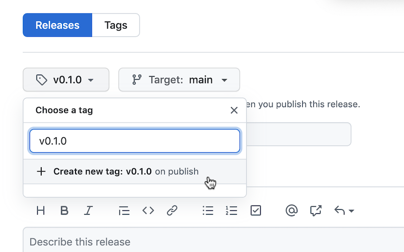

# Issuing a New Release 

The maintainers are able to issue a new release. The steps to publish release is a handful of manual steps since we want to ensure that issuing a release is a very conscious decision, requiring peer review, and cannot easily happen accidentally. There are main two steps to publish a new release:

## 1. Create a Release PR

* Create a new branch locally for the release, for example:

  ```
  git checkout -b releases/v0.1.0
  ```

* Tell Poetry to bump the version:
  ```
  poetry version [patch|minor|major]
  ```
  Note: This command is updating the version number in the pyproject.toml. You can totally do this manually. Helpful docs: [Poetry version command](https://python-poetry.org/docs/cli/#version), [Semantic Versioning](https://semver.org/)

* Update the [CHANGELOG](CHANGELOG.md) with the appropriate new version number and release date with the clear description

* Create a pull request for these changes, and get it approved

## 2. Create a new release from Github Page

Once your PR has been merged, the final piece is to actually create the new release.

1. Go to the [sample-size releases page](https://github.com/godaddy/sample-size/releases) and click on `Create a new release`.

1. Enter an appropriate tag version or create a new tag. Please prefix the version names with the letter `v`

    


1. Title the release. Generally these would just be in the form `Sample-Size 0.1.0`

1. Copy-paste the CHANGELOG entries for this new version into the description.

1. Click `Publish release`!

1. The publish workflow will be triggered automatically to release it to [PyPI](https://pypi.org/) for the new version!