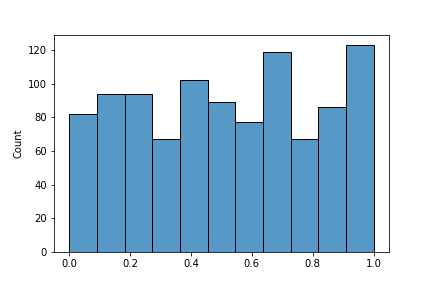
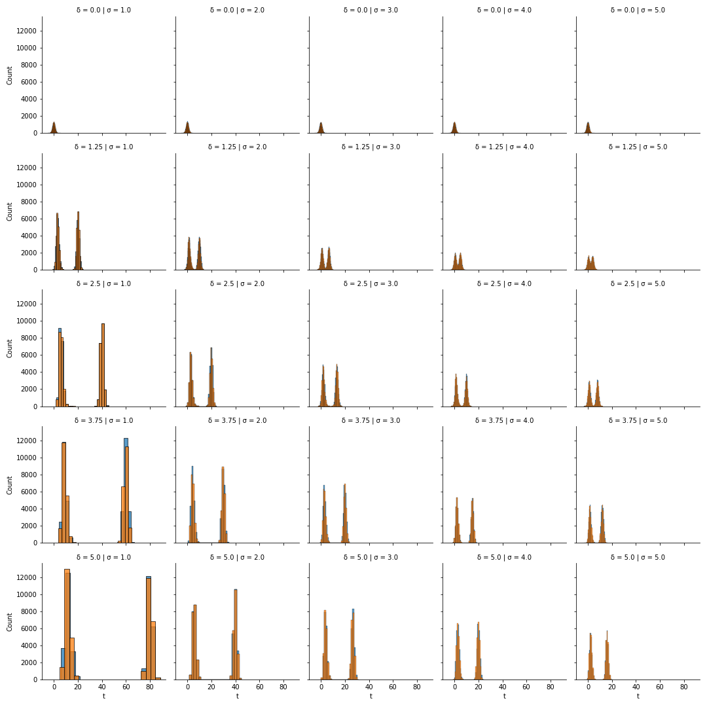
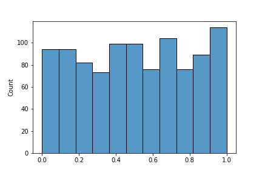
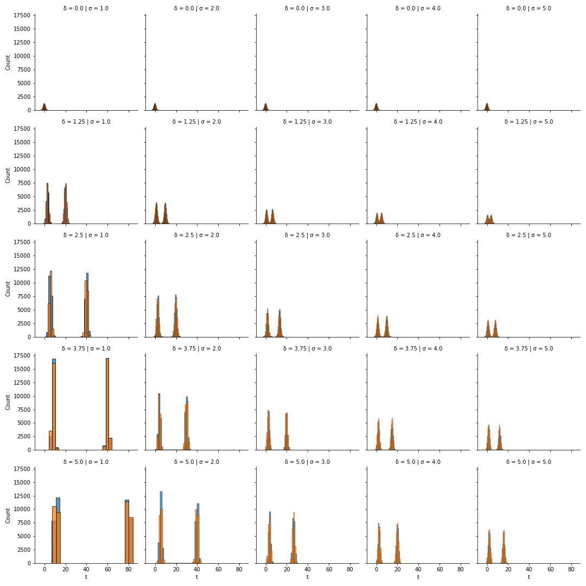

---
jupytext:
  cell_metadata_filter: -all
  formats: md:myst
  text_representation:
    extension: .md
    format_name: myst
    format_version: 0.13
    jupytext_version: 1.13.7
kernelspec:
  display_name: Python 3 (ipykernel)
  language: python
  name: python3
  
---
This notebook validates the p-value generation functions `generate_p_value` while the alternative hypothesis is true by comparing:
* sampling raw observations from the metric's distribution, calculating its test statistics and p-value, with
* directly sampling test statistics and calculating p-values from its distribution 

Parameters
* δ: MDE
* σ: standard deviation
* n: sample size
* size: number of replications

## Numeric Metrics
```python
import numpy as np
from scipy.stats import nct, ks_2samp
from itertools import product
from tqdm import tqdm
import pandas as pd
import seaborn as sns


def obs_sample(δ, σ, n, size):
    """
    This function samples from normally distributed numeric metric's observations under true alternative hypothesis and calculates the samples' p-values

    Attributes:
    δ: delta, the mean's shift from null hypothesis
    σ: sigma, standard deviation
    n: sample size
    size: replication
    
    """
    
    data = np.random.normal(loc=0, scale=σ, size=(2, size, n))
    data[1, :, :] += δ

    null, alt = data.mean(axis=-1)
    diff = alt - null

    pooled_sample_var = data.var(ddof=1, axis=-1).mean(axis=0)

    return diff / np.sqrt(2 * pooled_sample_var / n)

def direct_sample(δ, σ, n, size):
    """
    This function samples from normally distributed metric's observations under true alternative hypothesis and calculates the samples' p-values

    Attributes:
    δ: delta, the mean's shift from null hypothesis
    σ: sigma, standard deviation
    n: sample size
    size: replication
    
    """
      
    nc = np.sqrt(n/2) * δ / σ

    return nct.rvs(nc=nc, df=2*(n-1), size=size)

M = 1000
SIGMA = np.linspace(1, 5, 5)
DELTA = np.linspace(0, 5, 5)
N = range(10, 1010, 500)
REPLICATIONS = range(20)

results = []
p_values = []
for _, σ, δ, n in tqdm(product(REPLICATIONS, SIGMA, DELTA, N)):
    t_obs = obs_sample(δ, σ, n, M)
    t_direct= direct_sample(δ, σ, n, M)

    # test if the two approaches have same distributions
    # https://en.wikipedia.org/wiki/Kolmogorov%E2%80%93Smirnov_test
    _, p_value = ks_2samp(t_obs, t_direct)
    p_values.append(p_value)
    results.extend([{
        't': t,
        'σ': σ,
        'δ': δ,
        'n': n,
        'type': 'obs',
    } for t in t_obs])
    
    results.extend([{
        't': t,
        'σ': σ,
        'δ': δ,
        'n': n,
        'type': 'direct',
    } for t in t_direct])


results = pd.DataFrame(results)

p=sns.histplot(p_values)
p.set_xlabel("p-value")

g = sns.FacetGrid(results, col="σ",  row="δ",  hue='type')
g.map(sns.histplot, "t")
```



## Binomial and Ratio Metrics

Note: the test statistics has [non-central t distribution](https://en.wikipedia.org/wiki/Noncentral_t-distribution) with a non-central parameter [nc](https://journals.sagepub.com/doi/pdf/10.1177/1536867X0400400205)


```python
def obs_sample(δ, σ, n, size):
    """
    This function samples from normally distributed numeric metric's observations under true alternative hypothesis and calculates the samples' p-values
    
    Attributes:
    δ: delta, the mean's shift from null hypothesis
    σ: sigma, standard deviation
    n: sample size
    size: replication
    
    """
    data = np.random.normal(loc=0, scale=σ, size=(2, size, n))
    data[1, :, :] += δ

    null, alt = data.mean(axis=-1)
    diff = alt - null

    return diff / np.sqrt(2 * σ**2 / n)

def direct_sample(δ, σ, n, size):
    """
    This function samples from normally distributed metric's observations under true alternative hypothesis and calculates the samples' p-values

    Attributes:
    δ: delta, the mean's shift from null hypothesis
    σ: sigma, standard deviation
    n: sample size
    size: replication
    
    """

    effect_size = δ / float(np.sqrt(2*σ**2/n))
    return stats.norm.rvs(loc=effect_size, size=size)

M = 1000
SIGMA = np.linspace(1, 5, 5)
DELTA = np.linspace(0, 5, 5)
N = range(10, 1010, 500)
REPLICATIONS = range(20)

results = []
p_values = []
for _, σ, δ, n in tqdm(product(REPLICATIONS, SIGMA, DELTA, N)):
    t_obs = obs_sample(δ, σ, n, M)
    t_direct= direct_sample(δ, σ, n, M)

    # test if the two approaches have same distributions
    # https://en.wikipedia.org/wiki/Kolmogorov%E2%80%93Smirnov_test
    _, p_value = ks_2samp(t_obs, t_direct)

    p_values.append(p_value)
    results.extend([{
        't': t,
        'σ': σ,
        'δ': δ,
        'n': n,
        'type': 'obs',
    } for t in t_obs])
    
    results.extend([{
        't': t,
        'σ': σ,
        'δ': δ,
        'n': n,
        'type': 'direct',
    } for t in t_direct])


results = pd.DataFrame(results)

p=sns.histplot(p_values)
p.set_xlabel("p-value")

g = sns.FacetGrid(results, col="σ",  row="δ",  hue='type')
g.map(sns.histplot, "t")
```

